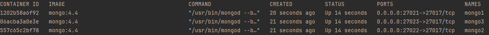
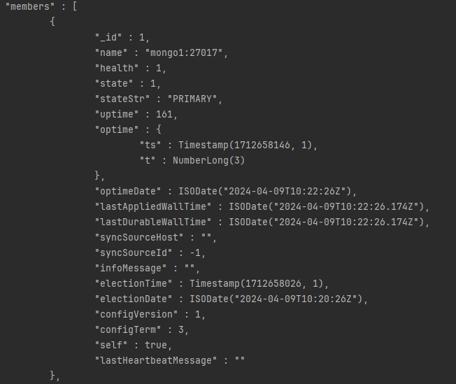

# Étape 1: Configuration de MongoDB en Mode Replica Set

Dans ce tutoriel, nous allons voir comment configurer MongoDB en mode Replica Set.


## Étapes
1. [Création du fichier docker-compose.yml](#1-création-du-fichier-docker-composeyml)
2. [Initialisation du Replica Set](#2-initialisation-du-replica-set)

### 1. Création du fichier docker-compose.yml
Créez un nouveau répertoire sur votre machine et créez un fichier `docker-compose.yml` à l'intérieur.

```yml
version: '3.8'

services:
  mongo1:
    container_name: mongo1
    image: mongo:4.4
    networks:
      - mongors-network
    ports:
      - 27021:27017
    links:
      - mongo2
      - mongo3
    restart: always
    entrypoint: [ "/usr/bin/mongod", "--bind_ip_all", "--replSet", "dbrs" ]
  mongo2:
    container_name: mongo2
    image: mongo:4.4
    networks:
      - mongors-network
    ports:
      - 27022:27017
    restart: always
    entrypoint: [ "/usr/bin/mongod", "--bind_ip_all", "--replSet", "dbrs" ]
  mongo3:
    container_name: mongo3
    image: mongo:4.4
    networks:
      - mongors-network
    ports:
      - 27023:27017
    restart: always
    entrypoint: [ "/usr/bin/mongod", "--bind_ip_all", "--replSet", "dbrs" ]

networks:
  mongors-network:
    driver: bridge
   ```

Dans ce fichier, nous avons défini trois services MongoDB, `mongo1`, `mongo2` et `mongo3`. 

Chaque service utilise l'image `mongo:4.4` et expose le port `27017` sur un port différent. 

Nous avons également défini un réseau `mongo-cluster` pour connecter les trois services.

Ouvrez un terminal et exécutez la commande suivante pour démarrer les services MongoDB.

```bash
docker-compose up --build -d 
```

Vous pouvez vérifier que les services sont en cours d'exécution en exécutant la commande suivante.

```bash
docker ps
```

Vous devriez voir trois conteneurs MongoDB en cours d'exécution.



---

# Étape 2: Initialisation du Replica Set

Dans cette étape, nous allons initialiser le Replica Set MongoDB.

### 1. Connexion au conteneur `mongo1`
```bash
docker exec -it mongo1 mongo
```

Étant donné que nous avons utilisé l'image `mongo:4.4`, le conteneur `mongo1` contient déjà le client `mongo`. et on peut se connecter directement à l'instance MongoDB en exécutant la commande ci-dessus.

### 2. Initialisation du Replica Set
```bash
var config = {
    "_id": "dbrs",
    "version": 1,
    "members": [
        {
            "_id": 1,
            "host": "mongo1:27017",
            "priority": 3
        },
        {
            "_id": 2,
            "host": "mongo2:27017",
            "priority": 2
        },
        {
            "_id": 3,
            "host": "mongo3:27017",
            "priority": 1
        }
    ]
};
rs.initiate(config, { force: true });
```

Cette commande initialise un Replica Set avec l'ID `rs0` et trois membres: `mongo1`, `mongo2` et `mongo3`.

Vous pouvez vérifier l'état du Replica Set en exécutant la commande suivante.

```bash
rs.status()
```

Vous devriez voir un résultat similaire à celui-ci.



---


# Explication du docker-compose.yml

Dans ce tutoriel, nous avons utilisé un fichier `docker-compose.yml` pour démarrer trois instances MongoDB en mode Replica Set.

Voici une explication des différentes parties du fichier `docker-compose.yml`.

```yml
version: '3.8'
```

La version de la spécification Docker Compose utilisée dans ce fichier.

```yml
services:
  mongo1:
    container_name: mongo1
    image: mongo:4.4
    networks:
      - mongors-network
    ports:
      - 27021:27017
    links:
      - mongo2
      - mongo3
    restart: always
    entrypoint: [ "/usr/bin/mongod", "--bind_ip_all", "--replSet", "dbrs" ]
```

Définition du service `mongo1`:
- `container_name`: Nom du conteneur.
- `image`: Image Docker utilisée pour le service, on utilise l'image `mongo:4.4` dans ce cas.
- `networks`: Réseau auquel le conteneur est connecté.
- `ports`: Mappage des ports du conteneur sur les ports de l'hôte.
- `links`: Liens vers d'autres services.
- `restart`: Politique de redémarrage du conteneur.
- `entrypoint`: Commande d'entrée à exécuter lors du démarrage du conteneur.

```yml
networks:
  mongors-network:
    driver: bridge
```

Définition du réseau `mongors-network` utilisé pour connecter les trois services MongoDB.
