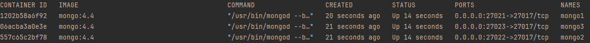
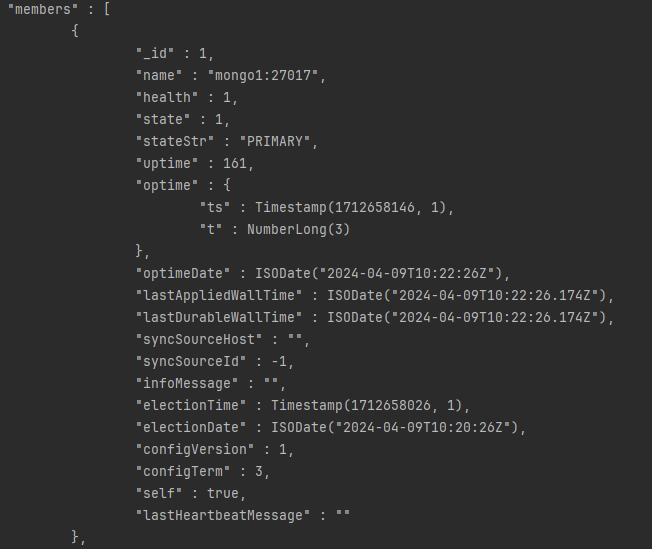

# Étape 1: Configuration de MongoDB en Mode Replica Set

Dans ce tutoriel, nous allons voir comment configurer MongoDB en mode Replica Set.

## Prérequis
- [MongoDB](https://www.mongodb.com/try/download/community) installé sur votre machine
- [MongoDB Compass](https://www.mongodb.com/try/download/compass) installé sur votre machine
- [Docker](https://docs.docker.com/get-docker/) installé sur votre machine
- [Docker Compose](https://docs.docker.com/compose/install/) installé sur votre machine
- [Git](https://git-scm.com/downloads) installé sur votre machine
- Un éditeur de texte (VS Code, Sublime Text, Atom, etc.)

## Étapes
1. [Création du fichier docker-compose.yml](#1-création-du-fichier-docker-composeyml)

### 1. Création du fichier docker-compose.yml
Créez un nouveau répertoire sur votre machine et créez un fichier `docker-compose.yml` à l'intérieur.

```yml
version: '3.8'

services:
  mongo1:
    image: mongo:4.4
    container_name: mongo1
    ports:
      - 27017:27017
    volumes:
      - ./data/mongo1:/data/db
    networks:
      - mongo-cluster

  mongo2:
    image: mongo:4.4
    container_name: mongo2
    ports:
      - 27018:27017
    volumes:
      - ./data/mongo2:/data/db
    networks:
      - mongo-cluster

  mongo3:
    image: mongo:4.4
    container_name: mongo3
    ports:
      - 27019:27017
    volumes:
      - ./data/mongo3:/data/db
    networks:
      - mongo-cluster

networks:
    mongo-cluster:
        driver: bridge
   ```

Dans ce fichier, nous avons défini trois services MongoDB, `mongo1`, `mongo2` et `mongo3`. 

Chaque service utilise l'image `mongo:4.4` et expose le port `27017` sur un port différent. 

Nous avons également défini un réseau `mongo-cluster` pour connecter les trois services.

Ouvrez un terminal et exécutez la commande suivante pour démarrer les services MongoDB.

```bash
docker-compose up --build -d 
```

Vous pouvez vérifier que les services sont en cours d'exécution en exécutant la commande suivante.

```bash
docker ps
```

Vous devriez voir trois conteneurs MongoDB en cours d'exécution.



---

# Étape 2: Initialisation du Replica Set

Dans cette étape, nous allons initialiser le Replica Set MongoDB.

### 1. Connexion au conteneur `mongo1`
```bash
docker exec -it mongo1 mongo
```

Étant donné que nous avons utilisé l'image `mongo:4.4`, le conteneur `mongo1` contient déjà le client `mongo`. et on peut se connecter directement à l'instance MongoDB en exécutant la commande ci-dessus.

### 2. Initialisation du Replica Set
```bash
rs.initiate(
  {
    _id: "rs0",
    members: [
      { _id: 0, host : "mongo1:27017" },
      { _id: 1, host : "mongo2:27017" },
      { _id: 2, host : "mongo3:27017" }
    ]
  }
)
```

Cette commande initialise un Replica Set avec l'ID `rs0` et trois membres: `mongo1`, `mongo2` et `mongo3`.

Vous pouvez vérifier l'état du Replica Set en exécutant la commande suivante.

```bash
rs.status()
```

Vous devriez voir un résultat similaire à celui-ci.



---
