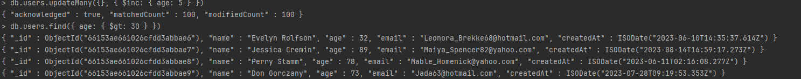

# Étape 3: Manipulations via la CLI MongoDB

Dans cette étape, nous allons effectuer quelques manipulations de base via la CLI MongoDB.

### Lecture ( Trouver tout les utilisateurs de plus de 30 ans )

1. Connectez-vous au conteneur `mongo1`.

```bash
docker exec -it mongo1 mongo
```

2. Exécutez la commande suivante pour trouver tous les utilisateurs de plus de 30 ans.

```bash
use test
db.users.find({ age: { $gt: 30 } })
```

Vous devriez voir les utilisateurs de plus de 30 ans.


### Mise à jour ( Mettre à jour l'âge de tous les utilisateurs en ajoutant 5 ans. )

1. Exécutez la commande suivante pour mettre à jour l'âge de tous les utilisateurs en ajoutant 5 ans.

```bash
db.users.updateMany({}, { $inc: { age: 5 } })
```



On peut voir que l'âge de tous les utilisateurs a été mis à jour en ajoutant 5 ans.

### Suppression ( Supprimer un utilisateur )

1. Exécutez la commande suivante pour supprimer un utilisateur.

```bash
db.users.deleteOne({ name: "Evelyn Rolfson" })
```


